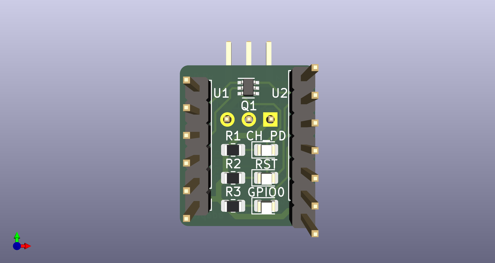
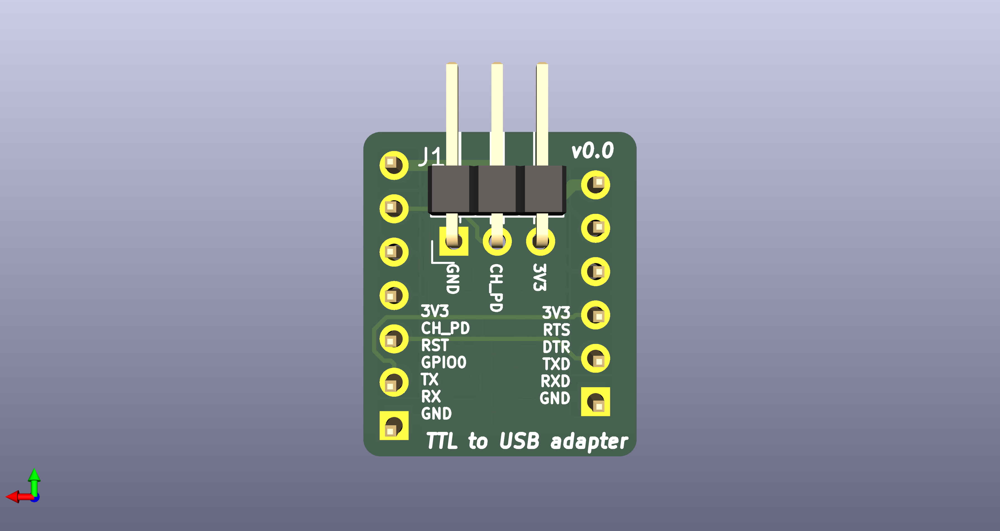
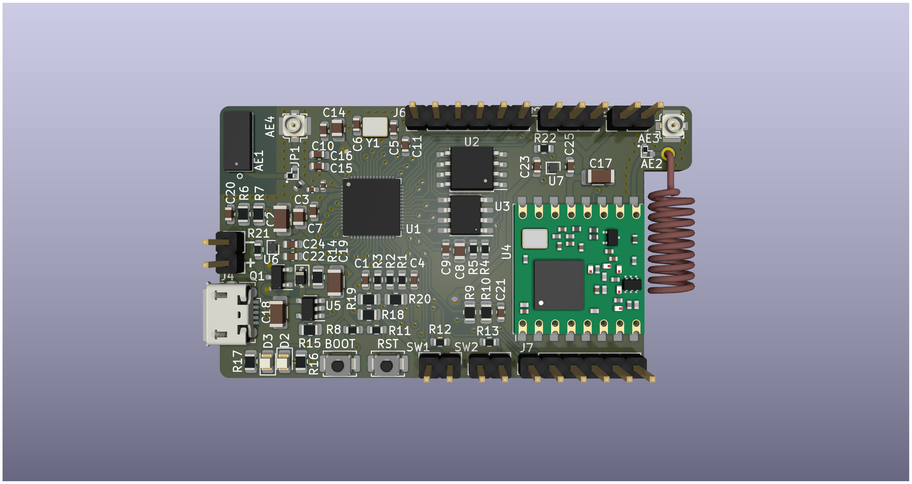
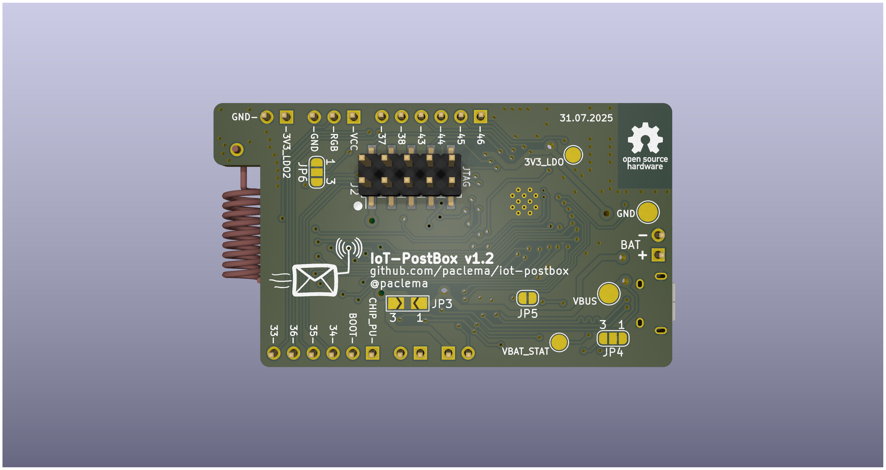

# IoT-PostBox PCB Designs

This folder contains all hardware designs for the IoT-PostBox project. These PCBs are intended for ultra-low power event detection and wireless notification, ideal for smart mailboxes or similar battery-powered IoT applications. The boards are designed to maximize battery life by staying in deep sleep and only waking up when an event is detected.  
**Typical use case:** Mount a switch at the mailbox slot or door to detect when a letter or package is inserted, triggering a wireless notification.

---

## 📝 How It Works

- **Event Detection:** The boards monitor switches (J1/J2) for events such as mailbox opening or mail insertion.
- **Wake-Up:** ESP8266 boards power on from switches, ESP32-S2 boards wake from deep sleep via GPIO interrupts
- **Notification:** Events are sent wirelessly (WiFi/MQTT for ESP8266, WiFi/MQTT and LoRaWAN for ESP32-S2)
- **Power Management:** Battery charging and monitoring circuits ensure safe operation and long battery life.

---

## 📦 IoT-Postbox v0.X (ESP8266/ESP-12)

- **Folder:** [`iot-postbox/`](iot-postbox/)
- **MCU:** ESP8266 (ESP-12F or ESP-07S)
- **Wake-up:** When either switch input (J1 or J2) closes, it physically pulls the CH_PD pin high, powering on the ESP8266 from a completely powered-down state. Once powered on, the firmware immediately activates GPIO14 to maintain CH_PD high, ensuring the system stays powered even if the switch opens during the notification process. After completing the notification and a configured delay, GPIO14 goes low, completely powering down the ESP8266 for maximum battery savings. The board can also be configured for deep sleep mode or continuous operation instead of complete power down via the onboard web app.
- **Features:**
  - Battery charger (TP4056) with overcharge, overdischarge, and overcurrent protection
  - Power management with LDO (candidates: ME6211 or MCP1700)
  - Switch sensor inputs for mailbox event detection
  - Deep sleep and wake-up logic via GPIO
  - WiFi and MQTT notifications for remote monitoring
- **Versions:**
  | v0.0 | v0.3 |
  |:----:|:----:|
  |  |  |
  | *First version* <br> Basic mailbox sensor with battery charger and power management. | *Added WS2812B LED strip for notifications* <br> *Updated battery sense resistors for improved ADC accuracy* <br> *Changed switch pinouts for better integration* |

- **Programming & Debugging:**  
  For ESP8266-based boards, external programming is required. Two options available:
  
  **Option 1: TTL-to-USB Adapter + FTDI Breakout**
  | Top View | Bottom View |
  |:------------------:|:----------------:|
  |  |  |
  - **Repository:** [`ttl_to_usb_adapter/`](ttl_to_usb_adapter/)
  - Converts DTR/RTS signals from an USB to Serial FTDI breakout board to ESP8266 boot sequence
  - Dedicated jumper for CH_PD control during programming

  **Option 2: Integrated USB Bridge**
  - **USBtoUART:** Complete solution available at [paclema.com/projects/usbtouart/](https://paclema.com/projects/usbtouart/) or at github.com/paclema/USBtoUART
  - Single device with integrated USB-to-UART conversion

---

## 📦 IoT-Postbox v1 (ESP32-S2)

- **Folder:** [`iot-postbox_v1/`](iot-postbox_v1/)
- **MCU:** ESP32-S2
- **Wake-up:** Switches (J1/J2) are configured as GPIO interrupts to wake up the MCU from deep sleep, instead of physically powering on the board (as in ESP8266). This allows more flexible event handling and enables distinguishing between different events.
- **Features:**
  - LoRa support (RFM95W module footprints)
  - Up to 16MB flash and 8MB PSRAM (optional, depending on SoC version)
  - Improved battery and power management (dedicated ADC sense for VBAT and VBUS)
  - Modular schematic split into INTERFACE, MCU, and POWER sections
  - Selectable onboard/uFL antennas for WiFi (JP1) and LoRa (JP2) by populating the correct resistor
  - Dedicated JTAG debug port
  - Multiple jumpers and test points on the back for configuration and debugging (including RPROG selection for battery charger IC)

- **Latest version:** IoT-PostBox v1.2
  | Top View | Bottom View |
  |:--------------:|:----------------:|
  |  |  |

- **Programming & Debugging:**  
  Programming and debugging for the ESP32-S2 board does **not require an external USB-to-UART bridge**. The ESP32-S2 features a native USB interface (USB-CDC/JTAG), allowing direct programming and serial communication via the onboard USB connector. Simply connect the board to your computer using a USB cable for firmware flashing and debugging.


### LiPo Charger & RPROG Selection

The onboard charger circuit is designed to be compatible with MCP73831/2, TP4054, and TP4065 ICs, allowing any of these to be used. The charging current is set by the RPROG resistor.

- **For MCP73831/2 (max 500mA) and TP4054 (max 800mA):**
  ```
  Ichg (mA) = 1000(v) / R(kΩ)
  ```
  | RPROG (Ω) | Charging Current (mA) |
  |-----------|----------------------|
  | 10k       | 100                  |
  | 5k        | 200                  |
  | 2k2       | 455                  |
  | 2k        | 500                  |
  | 1k        | 1000                 |

- **For TP4065 (max 600mA):**
  ```
  Ichg (mA) = 1100(v) / R(kΩ)
  ```
  | RPROG (Ω) | Charging Current (mA) |
  |-----------|----------------------|
  | 2k2       | 500                  |
  | 2k        | 600                  |

- **Note:**  
  - Choose the RPROG value based on your battery's specifications and desired charging speed.
  - Protections: Battery and input reverse polarity protection but no temperature or overcurrent protection.

- **VBAT_STAT output:**  
  - Tri-state output: for MCP73831.
  - Open-drain output: for MCP7383, TP4054 and TP4065.
  - Only for open-drain, `R18` makes sense because VDD_STAT can be configurable only in that case.
  - Monitored using ESP32-S2 GPIO3/ADC1_CH2 pin.

### Pinout Reference (IoT-Postbox v1.2)

Below are the pinouts for the main connectors on the back of the IoT-Postbox v1.2 PCB, including signal and ESP32-S2 functions:

#### J6 (EXT1 Expansion Port):

| Pin | Signal   | Function                                            |
|-----|----------|--------------------------------------------------------|
| 1   | GPIO46   | Strapping pin (can be used for boot mode selection)    |
| 2   | GPIO45   | Strapping pin (can be used for VDD_SPI selection)      |
| 3   | GPIO44   | UART0 RXD (default)                                    |
| 4   | GPIO43   | UART0 TXD (default)                                    |
| 5   | GPIO38   | I2C SCL (default)                                      |
| 6   | GPIO37   | SPI MISO (default)                                     |


#### J3 (LED Port):

| Pin | Signal      | Function                                 |
|-----|-------------|---------------------------------------------|
| 1   | VCC         | Power for LED strip (3V3_LDO2)              |
| 2   | RGB_LED_PWM | PWM output for RGB LED strip                |
| 3   | GND         | Ground                                      |

#### J5 (Power Output Port):

| Pin | Signal   | Function                                   |
|-----|----------|-----------------------------------------------|
| 1   | 3V3_LDO2 | Power output from peripheral LDO              |
| 2   | GND      | Ground                                        |

#### SW1 (Switch Sensor 1):

| Pin | Signal   | Function                                   |
|-----|----------|-----------------------------------------------|
| 1   | 3V3_LDO  | Power for switch sensor                       |
| 2   | SW1      | Digital input (event detection, GPIO input)   |

#### SW2 (Switch Sensor 2):

| Pin | Signal   | Function                                   |
|-----|----------|-----------------------------------------------|
| 1   | 3V3_LDO  | Power for switch sensor                       |
| 2   | SW2      | Digital input (event detection, GPIO input)   |

#### J7 (EXT2 Expansion Port):

| Pin | Signal   | Function                                   |
|-----|----------|-----------------------------------------------|
| 1   | CHIP_PU  | ESP32-S2 enable (power up, active high)       |
| 2   | BOOT     | Boot mode selection (GPIO0, strapping pin)    |
| 3   | GPIO34   | SPI MOSI (default)                            |
| 4   | GPIO35   | SPI SCK (default)                             |
| 5   | GPIO36   | SPI CS (default)                              |
| 6   | GPIO33   | I2C SDA (default)                             |

---

### 📚 Libraries

- **Folder:** [`libs/`](libs/)
- Contains KiCad symbols, footprints and 3D models, including Espressif official libraries and miscellaneous modules.

---

### 🛠️ Submodules Installation for KiCad

To pull KiCad lib submodules, run:
```sh
git submodule update --init --recursive
```